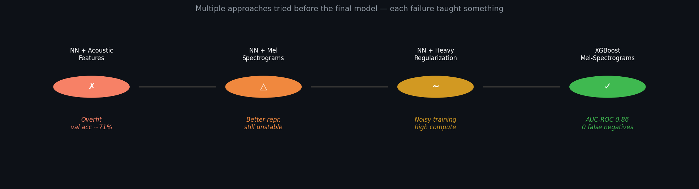
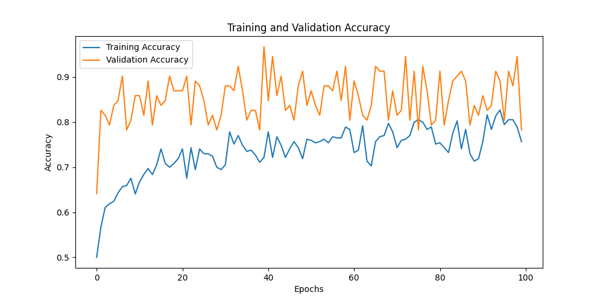
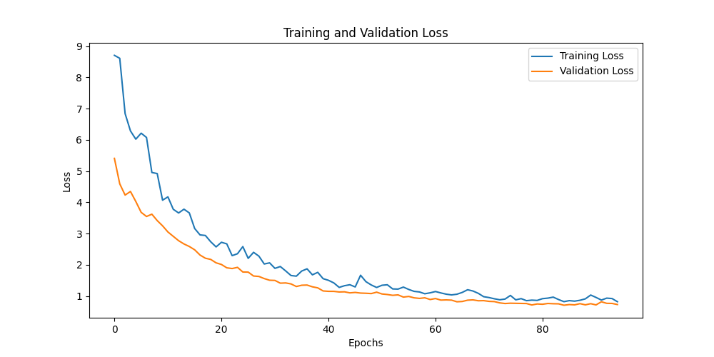
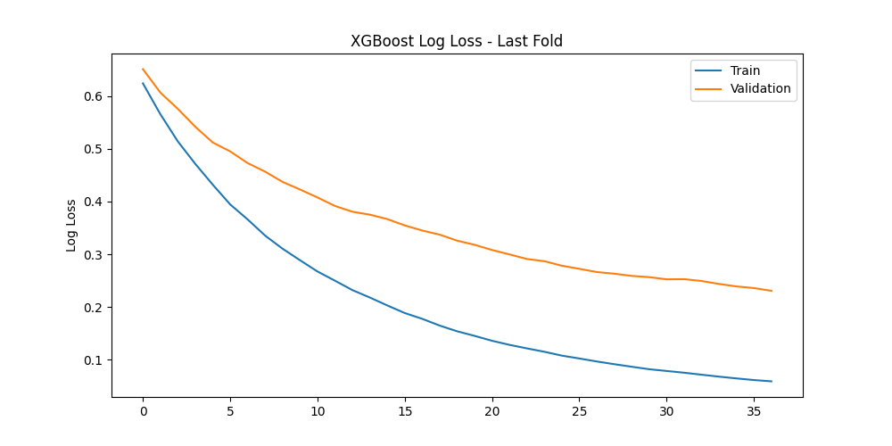
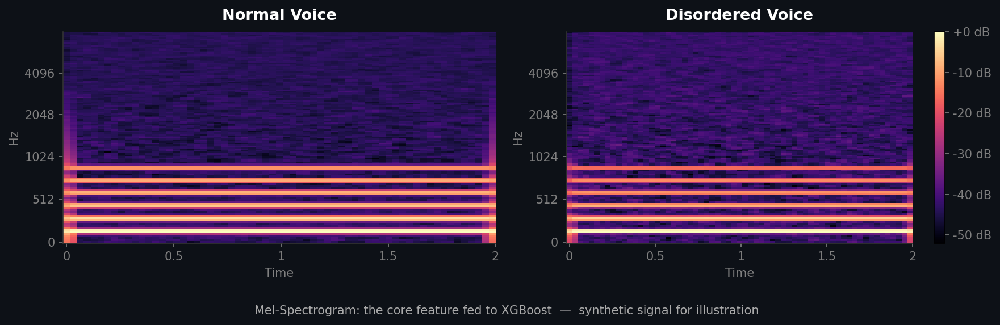
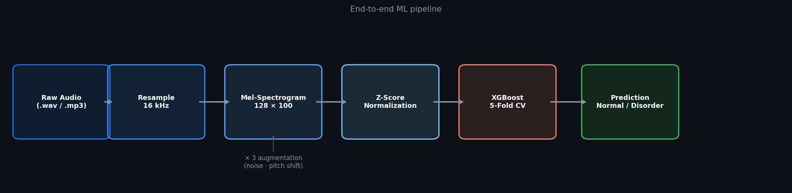
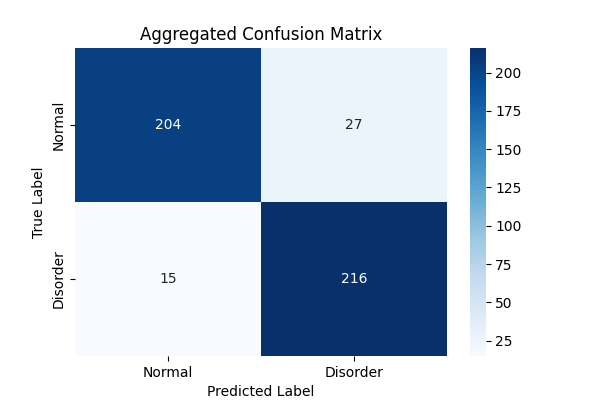
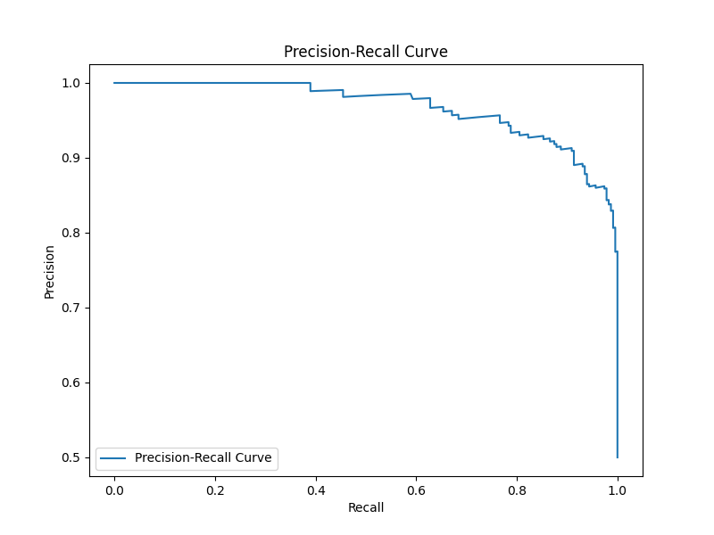

# VOCA — Voice Disorder Detection

> XGBoost classifier on Mel-Spectrograms that detects vocal disorders from raw audio — **AUC-ROC 0.86** across cross-validation, **87.8% CV accuracy**.


---

## The Problem

Voice disorders — spasmodic dysphonia, vocal nodules, vocal fold paralysis — often go undiagnosed for months or years. Clinical assessment requires a trained speech-language pathologist to evaluate each patient individually. That doesn't scale, especially in underserved or under-resourced settings where patients might wait months just to find out whether they need further care.

This project was built as a first-pass screening tool: feed it a short voice recording, and it tells you whether the acoustic patterns look normal or disordered. It's not a replacement for a clinician — it's the triage layer before one. Getting that binary decision right, and minimizing missed disorder cases, was the core design goal.

---

## Dataset & Why It's Not in This Repo

This project was built for the **Carle Illinois College of Medicine** as part of the VOCA Health initiative. Carle provided patient voice recordings covering three specific voice disorder types — Spasmodic Dysphonia, Vocal Nodules, and Vocal Fold Paralysis — alongside healthy voice samples.

The dataset cannot be shared publicly. These are real patient recordings from a clinical institution, subject to privacy constraints and the terms of the research collaboration. This is standard for healthcare AI projects — the model artifact and normalization parameters are included for inference, but the training data stays with Carle.

Working with a clinically constrained dataset drove every key decision in this project: why augmentation was necessary, why model selection leaned toward algorithms that generalize on limited data, and why validation strategy mattered more than it would on a standard benchmark dataset.

**Key properties:**
- Voice recordings labelled as Normal or one of three disorder types
- Perfectly balanced classes by design
- Augmented 3× (noise addition, pitch shifting) to expand the training pool
- Features: 128-band Mel-Spectrogram, resized to 128×100 frames → **12,800 features per sample**

---

## How I Got Here

This wasn't a single model decision. The project went through multiple approaches across two architectures before landing on the final solution. That evolution is the actual story.



### First approach — Dense NN on acoustic features

Started where the literature pointed: jitter (pitch irregularity), shimmer (amplitude irregularity), and harmonic-to-noise ratio. The professor supervising the project suggested these as standard voice disorder features — and clinically, they are. But compressing a 2-second voice recording into 3 numbers throws away almost everything the model could learn from. Training accuracy climbed, validation stalled. Classic small-dataset overfitting.

### The turning point — switching to Mel-Spectrograms

The feature representation was the bottleneck, not the model. Mel-Spectrograms encode the full frequency landscape over time — the structure of how harmonics behave, where the noise floor sits, whether pitch is stable or irregular. Switching to them alongside augmentation gave the model something real to learn from.

### Pushing the neural network harder

Tried making the neural network work: 60% dropout, stronger L2, early stopping, architecture simplification. The training curves tell the story better than words.



Validation accuracy jumps around wildly across 100 epochs. The model never settled. That orange line (validation) bouncing between 75–95% isn't confidence — it's noise. Training remained computationally expensive and initialization-sensitive.



Both losses converge eventually, but the gap between training and validation never fully closes. Good enough for a research experiment; not stable enough for a reliable classifier.

### Final — XGBoost

Switching to XGBoost on the same Mel-Spectrogram features resolved the instability immediately. Faster training, built-in L1/L2 regularization, no sensitivity to learning rate schedules or batch sizes. The convergence curves are a different story entirely.



Both train and validation log loss decreasing smoothly. No erratic jumps. Validation converges to ~0.23 and stays there. This is what stable training looks like.

Used 5-fold Stratified K-Fold Cross-Validation throughout to ensure balanced class representation in every fold — especially important with a clinical dataset where fold composition could otherwise skew results.

---

## Feature Representation — Why Mel-Spectrograms


*Synthetic signals for illustration — real recordings show the same structural contrast.*

A normal voice has stable, evenly-spaced harmonic bands across time. A disordered voice shows irregular patterns: frequency smearing, elevated noise floor, disrupted harmonic structure. That difference is visible in the spectrogram and learnable by a model that gets to see all of it.

Jitter and shimmer compress this into two numbers. The feature representation change — not any model tweak — was the single biggest performance lever in the project.

---

## The Pipeline



```
Raw Audio (.wav / .mp3 / .ogg / .m4a)
    → Resample to 16 kHz
    → Extract Mel-Spectrogram (128 bands × 100 frames)
    → 3× augmentation: noise addition · pitch shift
    → Z-score normalization  ←  fit on train fold only, never on full data
    → XGBoost · 5-fold Stratified K-Fold CV
    → Prediction: Normal or Disorder + confidence score
```

One thing I was deliberate about: normalization parameters are computed on the training fold only, then applied to validation. Fitting the scaler on the full dataset before splitting leaks information — it's a subtle mistake that inflates metrics without being obvious in the code.

---

## Results

### Cross-Validation Performance (primary metric — 5-fold aggregated)

| Metric | Score |
|--------|-------|
| **AUC-ROC** | **0.86** |
| **Accuracy** | **~87.8%** |
| **Recall (Disorder)** | **~91.8%** |
| **Precision (Disorder)** | **~85.4%** |

These are the numbers I'd quote in any production planning conversation — conservative estimates from held-out folds the model never trained on.

### Confusion Matrix — Cross-Validation Aggregated



The matrix shows where the model gets it right and where it struggles. The false negatives — disorder cases the model missed — are the most clinically important cells to watch. Reducing them is the primary optimization target for a screening tool: a missed disorder means delayed diagnosis, delayed treatment.

The false positives are the acceptable tradeoff — normal patients flagged for follow-up that a clinician quickly clears.

### Precision-Recall Curve



Precision stays near 1.0 across a wide recall range before dropping. That means: at moderate thresholds, almost every patient the model flags actually has a disorder. Only at very aggressive thresholds — pushing for maximum recall — does precision start to fall. For a clinical screening tool, that's the shape you want.

---

## What Didn't Work

**Overfitting on a clinically constrained dataset**

The neural network memorized training data. Dropout up to 60%, L2 regularization, early stopping — each iteration helped marginally but never eliminated the instability. Dense networks need more data than a constrained clinical set to generalize. XGBoost's ensemble approach handled it cleanly from the start.

**Jitter/Shimmer as features**

Three acoustic measurements can only go so far. They're clinically meaningful but compress too much information — different disorder subtypes can produce similar jitter/shimmer values while looking completely different in a spectrogram. The feature switch was the turning point of the whole project.

**Training instability in later NN iterations**

Even the best NN runs showed validation curves jumping 20 percentage points between consecutive epochs. Reproducibility was poor — different random seeds gave noticeably different results. XGBoost builds trees deterministically; convergence is smooth and repeatable.

---

## Threshold Analysis & Clinical Framing

Default threshold: 0.5 — predict Disorder if confidence exceeds 50%. In clinical deployment that's arbitrary and worth revisiting.

| Threshold | Effect | When to use |
|-----------|--------|-------------|
| 0.3 | Higher recall, more false alarms | Mass community screening — catch everything, clinicians filter |
| **0.5** | **Balanced — current default** | **General clinical support** |
| 0.7 | Higher precision, fewer false alarms | Specialist referral filter where FP rate matters |

In clinical screening, lowering the threshold is usually the right call — a false alarm costs a follow-up appointment; a missed disorder can cost years of delayed treatment.

---

## Experiment Log

| Approach | Key Change | Outcome | Decision |
|----------|-----------|---------|----------|
| NN + Jitter/Shimmer/HNR | Baseline | Overfit, ~71% val acc | Kept — baseline needed |
| + Dropout + L2 | Regularization | Marginal gain | Kept |
| + Early stopping | Stop at val plateau | Still overfit | Kept |
| **NN + Mel-Spectrograms** | **Feature repr. change** | Clear improvement | **Key insight** |
| + Augmentation | 3× dataset expansion | Better generalization | Kept |
| Heavy regularization (60% dropout) | Architecture squeeze | Noisy, unstable training | Not ideal |
| Extended NN training | 100 epochs, further tuning | Validation still erratic | Dropped NN |
| **XGBoost + Mel-Spec + 5-Fold CV** | **Model switch** | **AUC 0.86, ~87.8% CV acc** | **Shipped** |

---

## Assumptions & Limitations

**What this model does not handle:**
- Disorder types outside the three Carle-provided categories
- Significant background noise beyond the training augmentation level
- Audio recorded at very different quality from the clinical source (phone mic vs. clinical mic produces different spectrograms for the same voice)

**Where it would break in production:**
- Distribution shift if deployed on a different patient demographic than the training cohort
- Compressed audio artifacts at low bitrates
- No support for severity grading — output is binary, not a severity score

**What would make it meaningfully better:**
- More data per disorder type — the current model's recall isn't perfect; more diverse training samples would close that gap
- Multiple recordings per patient to capture intra-patient variability
- External validation on a second independent dataset before any clinical deployment

**On concept drift:** Voice disorder presentations change with age and treatment. A model trained on one cohort snapshot needs periodic revalidation as the patient population shifts.

---

## What I'd Do Next

1. **Per-disorder classification** — The three disorder types are labelled in the source data. A 4-class model gives clinicians actionable output instead of a binary flag. Binary was the right starting point; disorder-type identification is the obvious next step.

2. **SHAP on the spectrogram features** — With 12,800 input features the model is opaque right now. SHAP would identify which frequency bands and time windows drive the predictions. That's the kind of output a clinician can engage with — "irregular patterns in the 150–400 Hz range" means something; "Disorder: 89% confidence" on its own doesn't.

3. **External validation** — Before quoting these numbers in any clinical context, I'd want to evaluate on an independent dataset. If performance holds on a different cohort, the model is learning something real. If it drops significantly, the Carle-specific patterns are doing too much of the work.

4. **Structured experiment logging from the start** — The early NN runs have no saved metrics. The XGBoost runs have full figure outputs. A 10-line logging function writing parameters and results to a JSON file at every run would have made the whole evolution story much cleaner to document.

5. **Complete the Flask integration** — `algorithm/src/predict.py` is production-ready. The Flask backend already receives audio uploads at `/api/upload-audio` but currently only saves the file — it doesn't run inference. Adding a `/api/predict` endpoint that calls `VoiceDisorderPredictor.predict()` and returns JSON is the missing step to make this end-to-end functional.

---

## Model Card

| Field | Details |
|-------|---------|
| **Model type** | XGBoost (`binary:logistic`, max_depth=4, eta=0.1, L2 regularization) |
| **Intended use** | First-pass voice disorder screening support for clinicians |
| **Not suitable for** | Standalone diagnosis; disorder-type identification; deployment without validation on target population |
| **Training data** | Carle PVQD recordings, balanced classes, 3× augmented |
| **Input** | WAV audio file, resampled to 16 kHz |
| **Output** | P(Disorder) as float 0–1; threshold 0.5 default |
| **CV performance** | AUC-ROC 0.86, ~87.8% accuracy |
| **Known limitations** | Single clinical cohort; no external validation; binary output only |

---

## Team & Contribution

VOCA was a team project at Carle Illinois College of Medicine with three components:

| Component | Owner | Description |
|-----------|-------|-------------|
| **ML pipeline** (`algorithm/`) | **Rahul Balasubramani** | Feature extraction, model development across all approaches, evaluation |
| Flask backend (`backend/`) | Teammate | API server, file upload endpoint |
| iOS application (`ios-app/`) | Teammate | Audio recording, playback, upload UI |

Everything in this write-up is the ML pipeline work specifically.

---

## How to Run

```bash
git clone https://github.com/rahulb0206/VOCA_Voice-disorder-detection
cd VOCA_Voice-disorder-detection
pip install -r requirements.txt

# Run inference on a new audio file
python algorithm/src/predict.py --audio path/to/recording.wav

# Train from scratch (requires access to Carle PVQD recordings)
python algorithm/src/train.py --audio_dir path/to/renamed_audio_files/

# Organise raw PVQD files before training
python algorithm/src/preprocess.py organise \
    --excel    path/to/dataset.xlsx \
    --audio_in path/to/PVQD/Audio_Files/ \
    --audio_out path/to/renamed_audio_files/
```

**Example output from `predict.py`:**
```
=== VOCA Voice Disorder Prediction ===
  Prediction          : Disorder
  P(Normal)           : 6.3%
  P(Disorder)         : 93.7%
  Fundamental Freq    : 148.52 Hz
  Spectral Centroid   : 1823.4 Hz
  RMS Volume          : 0.0412
```

---

## Project Structure

```
VOCA_Voice-disorder-detection/
├── algorithm/
│   ├── src/
│   │   ├── train.py          # XGBoost training pipeline (clean, argparse)
│   │   ├── predict.py        # Inference on new audio files
│   │   └── preprocess.py     # Dataset organisation + optional audio cleaning
│   └── model/
│       ├── main/
│       │   ├── main.py       # Original training script (dev version)
│       │   ├── prediction.py # Original inference script (dev version)
│       │   └── class_reg.py  # Experimental multiclass NN (reference only)
│       └── other_codes/
│           ├── neural_network_code.py  # First NN approach — jitter/shimmer/HNR
│           ├── preprocess1.py          # PVQD file renaming script
│           └── preprocess2.py          # Optional audio cleaning utilities
├── outputs/
│   ├── figures/           # All training visualisations
│   └── models/
│       ├── voice_disorder_model.json   # Trained XGBoost model
│       └── mean_std_values.npy         # Per-feature normalization params
├── backend/               # Flask API server (teammate's component)
├── ios-app/               # SwiftUI iOS app (teammate's component)
├── requirements.txt
├── .gitignore
└── README.md
```

---

*Built as part of the VOCA Health project, Carle Illinois College of Medicine.*
